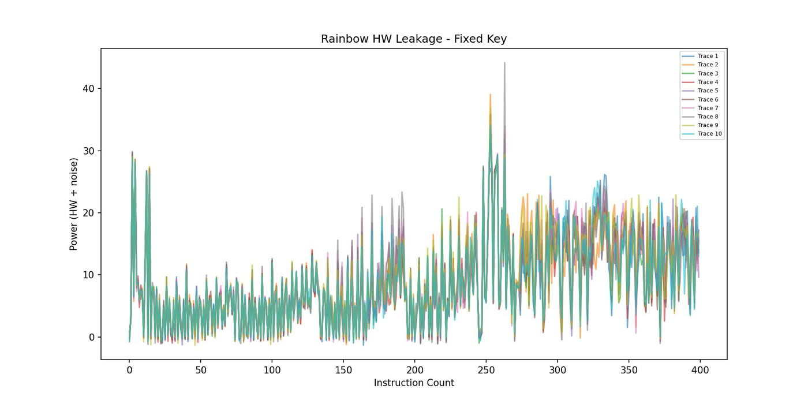
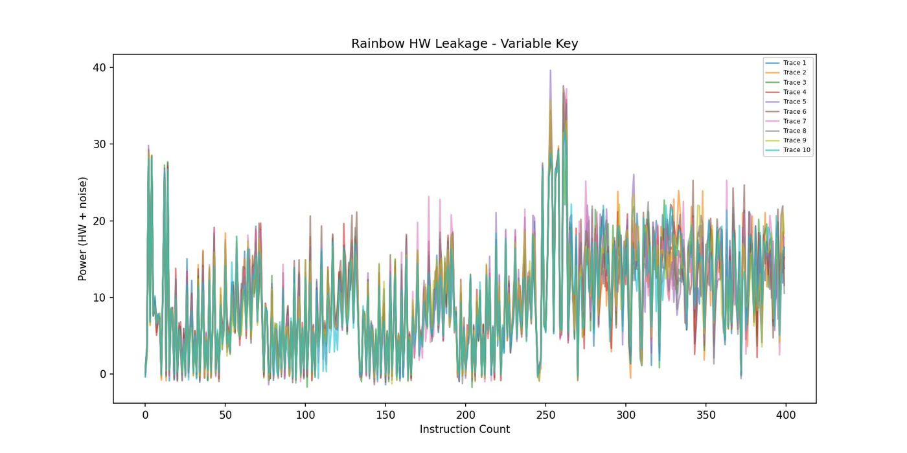
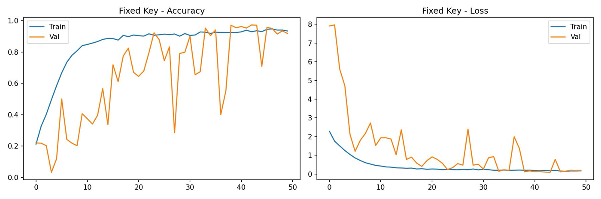
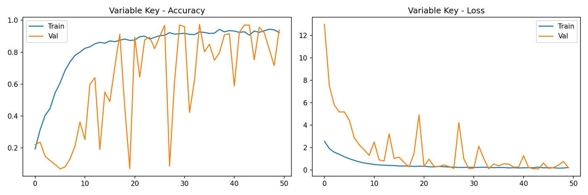

# Side-Channel Analysis of ASCON-128

> 📚 **Course:** Cyber Security — Spring 2026, NUST SEECS

A complete **profiled deep-learning side-channel attack** against a from-scratch C implementation of **ASCON-128** — the NIST Lightweight Cryptography standard. The pipeline compiles the cipher for ARM Cortex-M3, generates synthetic power traces in an emulator, and trains neural networks to recover secret key information from the leakage.

> CS-360 Cyber Security open-ended lab, NUST SEECS. The attack runs entirely on **emulated** execution and **synthetic** (Hamming-weight + noise) traces — no physical hardware or real measurements — and concludes with the countermeasures needed to defend against it.

---

## What this demonstrates

The end-to-end profiled-SCA workflow on a real standardized cipher: **C implementation → ARM build → emulated trace generation → deep-learning key recovery → security analysis.**

The target intermediate is the first ASCON S-box output during initialization, where the key is first mixed into the 320-bit state. Its Hamming weight modulates simulated dynamic power, giving the leakage a deep-learning model can exploit.

## Results

Two scenarios, each with 5,000 profiling traces + 1,000 attack traces (MLP over 9 Hamming-weight classes, 50 epochs):

| Scenario | Attack accuracy | Avg. key rank | Interpretation |
|---|:---:|:---:|---|
| **Fixed-key** | **93.90%** | 1.90 | Correct key hypothesis consistently in the top-2 — recovery feasible from few traces |
| **Variable-key** | **87.30%** | **1.00** | Perfect average rank — model learned *key-independent* HW leakage that generalizes to unseen keys |
| Fixed-key model on variable-key data (cross-eval) | 37.20% | — | A fixed-key model does **not** generalize — classic profiled-SCA overfitting |

**Headline finding:** the variable-key model achieves a *better* average key rank (1.00 vs 1.90) than the fixed-key model despite lower raw accuracy. By training across random keys it is forced to learn the generalizable Hamming-weight leakage relationship rather than memorizing one key's power template — and the 37.20% cross-evaluation confirms the fixed-key model overfits to its specific key.

### Simulated power traces (Rainbow Cortex-M3, Hamming-weight model)

| Fixed key | Variable key |
|---|---|
|  |  |

The spikes near instructions ~10 and ~250 correspond to the initialization and S-box permutation phases. Variable-key traces diverge more after instruction ~50, reflecting the differing key material at each execution.

### Training curves

| Fixed key | Variable key |
|---|---|
|  |  |

The fixed-key model converges smoothly; the variable-key validation curve is more erratic because of key diversity, yet still stabilizes — demonstrating genuine generalization rather than memorization.

---

## Pipeline

```
ascon128.c ──arm-none-eabi-gcc──► ascon128.elf
                                       │
                  LIEF locates key/nonce/main symbols
                                       │
              Rainbow (Unicorn) Cortex-M3 emulator + HW leakage
                                       │
                   fixed_key_traces.h5 / variable_key_traces.h5
                                       │
                          MLP (TensorFlow/Keras)
                                       │
            key-rank analysis ──► recovered key-byte ranking
```

### 1. Cipher implementation — `src/ascon128.c`
ASCON-128 written from the specification: 320-bit state as five `uint64_t` words, a rounds-parameterized permutation shared by p¹² (init/finalize) and p⁶ (data), bit-sliced S-box (no lookup table, constant-time), and the linear diffusion layer. `key`/`nonce` are global symbols so the emulator can inject values at runtime. Built for ARM Cortex-M3:

```bash
arm-none-eabi-gcc -mcpu=cortex-m3 -mthumb -O2 -g -o ascon128.elf ascon128.c --specs=nosys.specs
```

### 2. Trace generation — `src/generate_traces.py`
Parses the ELF with LIEF, loads it into the Rainbow STM32F2 (Cortex-M3) emulator, and for each encryption injects a key/nonce, runs `main`, and records the per-instruction register Hamming weight (+ Gaussian noise, σ=0.5) as a 400-sample trace. Produces a fixed-key set (one constant key) and a variable-key set (a unique random key per trace), each 5,000 profiling + 1,000 attack traces, stored as HDF5.

### 3. Deep-learning attacks — `src/attack_fixed_key.py`, `src/attack_variable_key.py`
MLP classifiers (Dense + BatchNorm + Dropout) over the 9 Hamming-weight classes, trained on profiling traces and evaluated on the attack set. Each script reports attack accuracy and runs a key-rank analysis (averaging model predictions over random subsets and locating the true class in the ranked output). The variable-key script additionally cross-evaluates the saved fixed-key model on variable-key data. Trained models are in `models/`.

---

## Repository layout

```
.
├── src/
│   ├── ascon128.c              # ASCON-128 in C (ARM Cortex-M3 target)
│   ├── generate_traces.py      # Rainbow/Unicorn emulated trace generation
│   ├── attack_fixed_key.py     # fixed-key profiled attack + key rank
│   └── attack_variable_key.py  # variable-key attack + cross-evaluation
├── models/
│   ├── model_fixed_key.h5       # trained fixed-key MLP
│   └── model_variable_key.h5    # trained variable-key MLP
├── assets/                      # result figures
└── docs/
    ├── Lab11_ASCON_SCA_report.pdf   # full ASCON report (this project)
    └── Lab08_XOR_SCA_report.pdf     # precursor: end-to-end SCA on a 128-bit XOR cipher
```

## Background — the XOR-cipher precursor (Lab 08)

This project builds on an earlier end-to-end SCA exercise (`docs/Lab08_XOR_SCA_report.pdf`) that established the same pipeline against a simpler 128-bit XOR cipher: implement in C → emulate → generate HW-leakage traces → MLP key recovery. That work attacked a single key byte and reached 100% recovery (rank 0) in the fixed-key case and ~1.7% in the variable-key case under a stricter per-trace-unique-key setup. ASCON-128 extends the same methodology to a non-linear, NIST-standardized cipher.

## Running it

```bash
pip install numpy h5py tensorflow matplotlib lief donjon-rainbow unicorn
# 1. build the ELF (needs the ARM GCC toolchain)
arm-none-eabi-gcc -mcpu=cortex-m3 -mthumb -O2 -g -o ascon128.elf src/ascon128.c --specs=nosys.specs
# 2. generate traces (writes fixed_key_traces.h5 / variable_key_traces.h5)
python src/generate_traces.py
# 3. run the attacks
python src/attack_fixed_key.py
python src/attack_variable_key.py
```

## Security takeaway

ASCON-128's theoretical security does **not** imply implementation security. An unprotected software implementation leaks exploitable Hamming-weight information through (simulated) power, and a profiled model recovers key information from a small number of traces. Real deployments on embedded hardware need countermeasures: **masking** (randomizing intermediates to decorrelate power from secret data), **hiding** (timing randomization / dummy operations), and **algorithmic noise injection** to lower trace SNR.

## Tech stack

C (ARM Cortex-M3) · arm-none-eabi-gcc · Rainbow / Unicorn emulator · LIEF · TensorFlow/Keras · NumPy · h5py · matplotlib

## Author

Muhammad Taha (467244), BSCS-13A — NUST SEECS, CS-360 Cyber Security.
